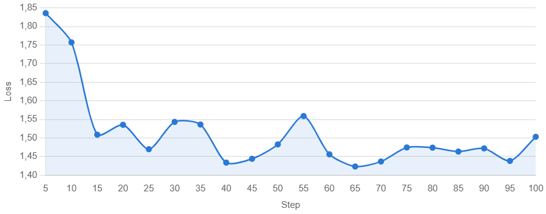

# Rapport Final : Pipeline IA Médicale et Audit Financier

## 1. Vue d'ensemble

Ce dépôt documente les travaux réalisés dans le cadre du hackathon pour le projet SOCket. L'objectif était double :

1. **Fine-tuning médical** : Initialiser une pipeline d'entraînement pour un modèle spécialisé en biomédecine.
2. **Audit de sécurité (Crash-Test)** : Évaluer la viabilité d'un modèle financier existant (`Phi-3.5-Financial`) pour une mise en production.

---

## 2. Volet I : Fine-Tuning Médical (Phi-3.5)

### Objectif : Adaptation du modèle aux données biomédicales.

* **Modèle choisi** : `microsoft/Phi-3.5-mini-instruct` (3.8B paramètres).
* **Dataset** : Utilisation de `clean_pubmedqa_instruction.json` (format instruction-response).
* **Approche technique** :
* **QLoRA (Quantized LoRA)** : Entraînement efficace en 4-bit pour s'adapter aux contraintes matérielles (GPU).
* **Preprocessing** : Conversion du dataset PubMedQA en format instruction-réponse conforme au cahier des charges du projet.

* **Statut** : Pipeline d'entraînement fonctionnelle et validée de bout en bout.
* *Note technique* : Le script `train_medical.py` a été testé et est opérationnel. L'entraînement est configuré avec des checkpoints réguliers (10, 20, 30... steps). Face aux limitations du GPU gratuit fourni par les instances Colab, l'entraînement a finalement été exécuté sur une machine locale équipée d'une RTX 4070 (8 Go VRAM), avec un run de 100 steps en ~16 minutes et une loss passant de 1.84 à ~1.45-1.51 (voir courbe ci-dessus).

**Note sur l'environnement d'entraînement**

Le projet recommandait initialement Google Colab pour le fine-tuning. Cependant, la version gratuite de Colab impose plusieurs contraintes incompatibles avec les délais du hackathon :

- Sessions limitées dans le temps (déconnexion après inactivité ou après ~12h, parfois bien moins selon la disponibilité GPU)
- Allocation GPU non garantie (on peut se retrouver sans GPU disponible, ou avec un GPU partagé moins performant comme un T4 bridé)
- Risque de perte de progression si la session expire en plein entraînement, sans sauvegarde automatique vers un stockage persistant

Pour fiabiliser le pipeline et garantir un résultat reproductible dans les temps impartis, nous avons basculé l'entraînement sur une machine locale équipée d'une RTX 4070 (8 Go VRAM). Cela a nécessité une adaptation de l'environnement (PyTorch CUDA, dépendances `transformers`/`peft`/`trl`/`bitsandbytes`) ainsi que des ajustements de configuration pour tenir dans 8 Go de VRAM (gradient checkpointing, batch size réduit, séquences limitées à 512 tokens, précision bf16).

Résultat : un entraînement LoRA (QLoRA 4-bit) de Phi-3.5-mini-instruct sur 100 steps en ~16 minutes, avec une loss passant de 1.84 à ~1.45-1.51, confirmant la stabilité du pipeline.

---

## 3. Volet II : Audit et Crash-Test (IA Financière)

### Objectif : Évaluer la sécurité et la fiabilité du modèle `Phi-3.5-Financial` avant déploiement.

Nous avons soumis le modèle à un "crash-test" de 10 questions critiques (théorie, calcul, pièges éthiques, données en temps réel).

#### **Synthèse de l'audit**

Le modèle présente des failles critiques qui bloquent sa mise en production :

1. **Instabilité technique** : Coupures chroniques de génération et présence de parasites (*glitches*).
2. **Biais de localisation** : Incompétence sur les règles fiscales françaises (PEA, etc.), imposant un prisme américain erroné.
3. **Déficit linguistique** : Qualité du français très médiocre (néologismes, franglais), suggérant une traduction automatique mal intégrée.

**Verdict : REJETÉ pour la production.**

---

## 4. Fichiers du dépôt

* `/dataset/clean_pubmedqa_instruction.json` : Données médicales nettoyées.
* `/src/train_medical.py` : Script de fine-tuning QLoRA pour Phi-3.5.
* `/docs/question_IA_financière.md` : Grille détaillée des 10 questions de test et résultats.

---

## 5. Conclusion stratégique

Le travail réalisé démontre une maîtrise de la pipeline de développement IA (de l'ingénierie des données à l'évaluation de sécurité). La décision de bloquer la mise en production du modèle financier est une mesure de **gestion des risques nécessaire**. Les prochaines étapes recommandées sont :

* Le passage sur une instance cloud dédiée (type RunPod) pour finaliser l'entraînement médical.
* La ré-évaluation de la stratégie de traduction du modèle financier pour corriger les biais de localisation.
